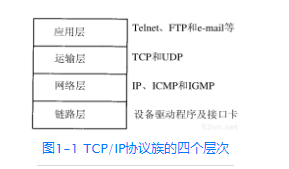
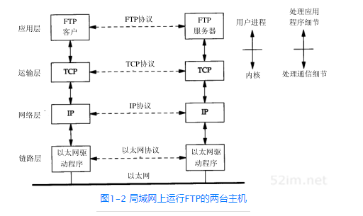
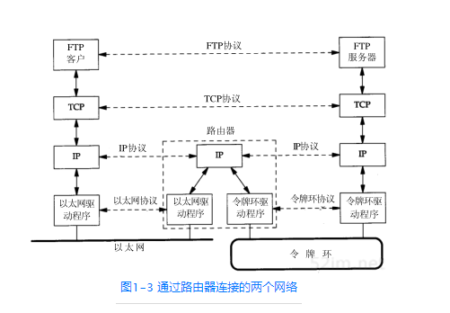
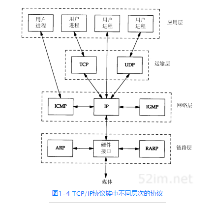
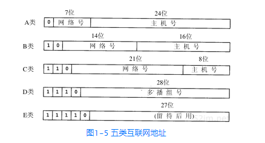
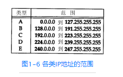
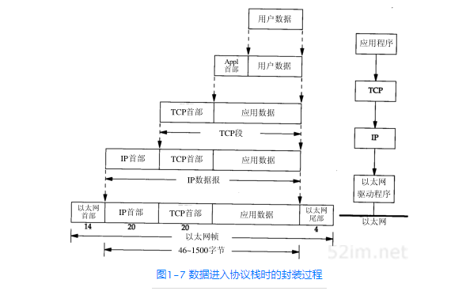
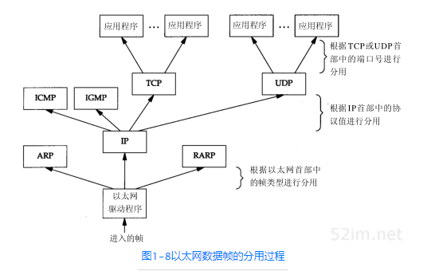

# 第一章 概述
## 1.1 引言
```
TCP/IP协议族: 成为被称作“全球互联网”或“因特网(Internet)”的基础
广域网: WAN
```
## 1.2 分层
### 1.2.1 tcp/ip的四层模型
</img>
```
1.链路层，有时也称作数据链路层或网络接口层，通常包括操作系统中的设备驱动程序和计算机中对应的网络接口卡。它们一起处理与电缆（或其他任何传输媒介）的物理接口细节。
2.网络层，有时也称作互联网层，处理分组在网络中的活动，例如分组的选路。在TCP/IP协议族中，网络层协议包括IP协议（网际协议），ICMP协议（Internet互联网控制报文协议），以及IGMP协议（Internet组管理协议）。
3.运输层主要为两台主机上的应用程序提供端到端的通信。在TCP/IP协议族中，有两个互不相同的传输协议：TCP（传输控制协议）和UDP（用户数据报协议）。
4.应用层负责处理特定的应用程序细节。
```
### 1.2.2 ftp协议
<font color=pink size=3>
FTP是一种应用层协议，TCP是一种运输层协议，IP是一种网络层协议，而以太网协议则应用于链路层上。TCP/IP协议族是一组不同的协议组合在一起构成的协议族。尽管通常称该协议族为TCP/IP，但TCP和IP只是其中的两种协议而已（该协议族的另一个名字是Internet协议族(Internet Protocol Suite)）。
</p>
把孤立的系统组在一起形成网络，把多个网络连在一起形成一个网络的网络，或称作互连网(internet)。一个互连网就是一组通过相同协议族互连在一起的网络。
</font>
</p>
</img>

```
我们注意到应用程序通常是一个用户进程，而下三层则一般在（操作系统）内核中执行。尽管这不是必需的，但通常都是这样处理的，例如UNIX操作系统。

顶层与下三层之间还有另一个关键的不同之处。应用层关心的是应用程序的细节，而不是数据在网络中的传输活动。下三层对应用程序一无所知，但它们要处理所有的通信细节。
```

构造互连网最简单的方法是把两个或多个网络通过路由器进行连接。它是一种特殊的用于网络互连的硬件盒。<font color=pink>路由器的好处是为不同类型的物理网络提供连接：以太网、令牌环网、点对点的链接和FDDI（光纤分布式数据接口）等等。</font>

```
这些盒子也称作IP路由器（IP Router），但我们这里使用路由器(Router)这个术语。从历史上说，这些盒子称作网关（gateway），在很多TCP/IP文献中都使用这个术语。现在网关这个术语只用来表示应用层网关：一个连接两种不同协议族的进程（例如，TCP/IP和IBM的SNA），它为某个特定的应用程序服务（常常是电子邮件或文件传输）。
```
### 1.2.3 通过路由器连接的两个网络
</img>

```
我们可以划分出端系统（End system）（两边的两台主机）和中间系统（Intermediate system）（中间的路由器）。应用层和运输层使用端到端（End-to-end）协议。在图中，只有端系统需要这两层协议。但是，网络层提供的却是逐跳（Hop-by-hop）协议，两个端系统和每个中间系统都要使用它。
```
<font color=pink>
网络层IP提供的是一种不可靠的服务。也就是说，它只是尽可能快地把分组从源结点送到目的结点，但是并不提供任何可靠性保证。而另一方面，TCP在不可靠的IP层上提供了一个可靠的运输层。为了提供这种可靠的服务，TCP采用了超时重传、发送和接收端到端的确认分组等机制。由此可见，运输层和网络层分别负责不同的功能。
</font>

## 1.3 TCP/IP的分层


```
IP是网络层上的主要协议，同时被TCP和UDP使用。TCP和UDP的每组数据都通过端系统和每个中间路由器中的IP层在互联网中进行传输。

ICMP是IP协议的附属协议。IP层用它来与其他主机或路由器交换错误报文和其他重要信息。

IGMP是Internet组管理协议。它用来把一个UDP数据报多播到多个主机。

ARP（地址解析协议）和RARP（逆地址解析协议）是某些网络接口（如以太网和令牌环网）使用的特殊协议，用来转换IP层和网络接口层使用的地址。
```

## 1.4 互联网的地址



<font color=pink size=3>
由于互联网上的每个接口必须有一个唯一的IP地址，因此必须要有一个管理机构为接入互联网的网络分配IP地址。这个管理机构就是互联网络信息中心（Internet Network Information Centre），称作InterNIC。InterNIC只分配网络号。主机号的分配由系统管理员来负责。
</font>

```
区分各类地址的最简单方法是看它的第一个十进 制整数。

多接口主机具有多个IP地址，其中每个接口都对应一个IP地址。
```

## 1.5 域名系统
## 1.6 封装
当应用程序用TCP传送数据时，数据被送入协议栈中，然后逐个通过每一层直到被当作一串比特流送入网络。其中每一层对收到的数据都要增加一些首部信息（有时还要增加尾部信息）。
<font color=pink size=3>
TCP传给IP的数据单元称作TCP报文段或简称为TCP段（TCP segment）。IP传给网络接口层的数据单元称作IP数据报(IP datagram)。通过以太网传输的比特流称作帧(Frame)。</font>
</img>
```
UDP数据与TCP数据基本一致。唯一的不同是UDP传给IP的信息单元称作UDP数据报（UDP datagram），而且UDP的首部长为8字节。
```
<font color=pink size=3>

1. 由于TCP、UDP、ICMP和IGMP都要向IP传送数据，因此IP必须在生成的IP首部中加入某种标识，以表明数据属于哪一层。为此，IP在首部中存入一个长度为8bit的数值，称作协议域。1表示为ICMP协议，2表示为IGMP协议，6表示为TCP协议，17表示为UDP协议。

2. 许多应用程序都可以使用TCP或UDP来传送数据。运输层协议在生成报文首部时要存入一个应用程序的标识符。TCP和UDP都用一个16bit的端口号来表示不同的应用程序。TCP和UDP把源端口号和目的端口号分别存入报文首部中。

3. 网络接口分别要发送和接收IP、ARP和RARP数据，因此也必须在以太网的帧首部中加入某种形式的标识，以指明生成数据的网络层协议。为此，以太网的帧首部也有一个16 bit的帧类型域。

</font>

## 1.7 分用
当目的主机收到一个以太网数据帧时，数据就开始从协议栈中由底向上升，同时去掉各层协议加上的报文首部。每层协议盒都要去检查报文首部中的协议标识，以确定接收数据的上层协议。这个过程称作分用（Demultiplexing）。
</img>

## 1.8 客户-服务器模型
## 1.9 端口号
```
客户端通常对它所使用的端口号并不关心，只需保证该端口号在本机上是唯一的就可以了。客户端口号又称作临时端口号（即存在时间很短暂）。这是因为它通常只是在用户运行该客户程序时才存在，而服务器则只要主机开着的，其服务就运行。

大多数TCP/IP实现给临时端口分配1024～5000之间的端口号。大于5000的端口号是为其他服务器预留的（Internet上并不常用的服务)。
```
## 1.10 标准化过程
## 1.11 RFC
## 1.12 标准的简单服务
## 1.13 互联网
## 1.14 实现
## 1.15 应用编程接口
## 1.16 测试网络