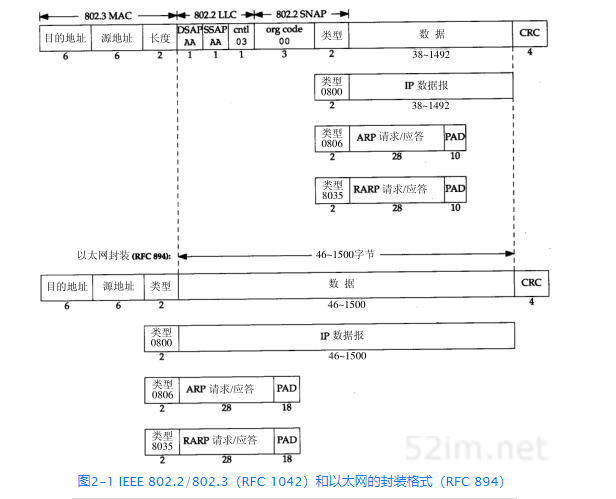
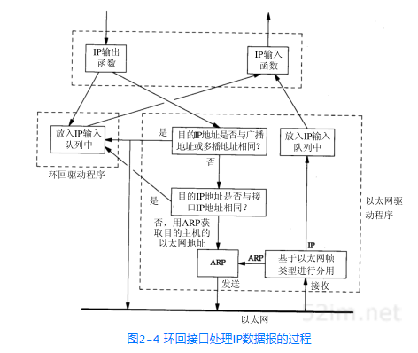
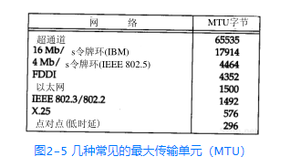

# 第二章 链路层
## 2.1 引言
> 链路层主要有三个目的：（1）为IP模块发送和接收IP数据报；（2）为ARP模块发送ARP请求和接收ARP应答；（3）为RARP发送RARP请求和接收RARP应答。
## 2.2 以太网和IEEE 802封装
在TCP/IP世界中，以太网IP数据报的封装是在RFC 894[Hornig 1984]中定义的，IEEE 802网络的IP数据报封装是在RFC 1042[Postel and Reynolds 1988]中定义的。主机需求RFC要求每台Internet主机都与一个10 Mb/s的以太网电缆相连接：
>1. 必须能发送和接收采用RFC 894（以太网）封装格式的分组。
>2. 应该能接收与RFC 894混合的RFC 1042（IEEE 802）封装格式的分组。
>3. 也许能够发送采用RFC 1042格式封装的分组。如果主机能同时发送两种类型的分组数据，那么发送的分组必须是可以设置的，而且默认条件下必须是RFC 894分组。

两种帧格式都采用48 bit（6字节）的目的地址和源地址（802.3允许使用16 bit的地址，但一般是48 bit地址）。这就是我们在本书中所称的硬件地址。ARP和RARP协议对32 bit的IP地址和48 bit的硬件地址进行映射。
</img>

## 2.3 尾部封装
## 2.4 SLIP：串行线路IP
## 2.5 压缩的SLIP
## 2.6 PPP：点对点协议
## 2.7 环回接口
```
大多数的产品都支持环回接口（Loopback Interface），以允许运行在同一台主机上的客户程序和服务器程序通过TCP/IP进行通信。A类网络号127就是为环回接口预留的。根据惯例，大多数系统把IP地址127.0.0.1分配给这个接口，并命名为localhost。一个传给环回接口的IP数据报不能在任何网络上出现
```
</img>

## 2.8 最大传输单元MTU
<font color=pink size=3>
以太网和802.3对数据帧的长度都有一个限制，其最大值分别是1500和1492字节。链路层的这个特性称作MTU ,最大传输单元。不同类型的网络大 多数都有一个上限。

如果IP层有一个数据报要传，而且数据的长度比链路层的MTU还大,那么IP层就需要进行分片（fragmentation），把数据报分成若干片，这样每一片都小于MTU。
</font>


## 2.9 路径MTU
> 当在同一个网络上的两台主机互相进行通信时，该网络的MTU是非常重要的。但是如果两台主机之间的通信要通过多个网络，那么每个网络的链路层就可能有不同的MTU。重要的不是两台主机所在网络的MTU的值，重要的是两台通信主机路径中的最小MTU。它被称作路径MTU。
## 2.10 串行线路吞吐量计算